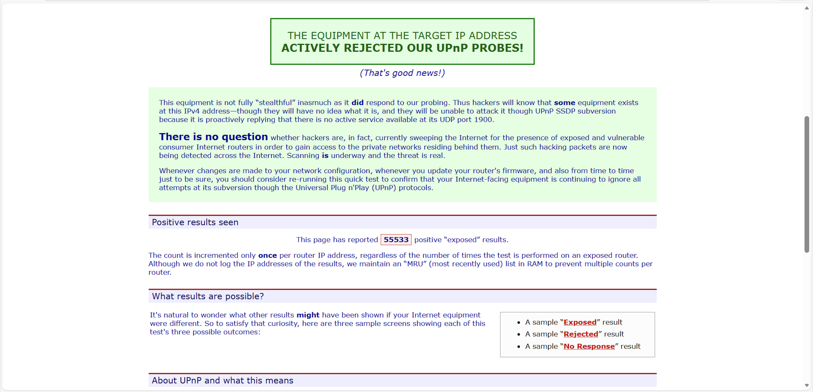
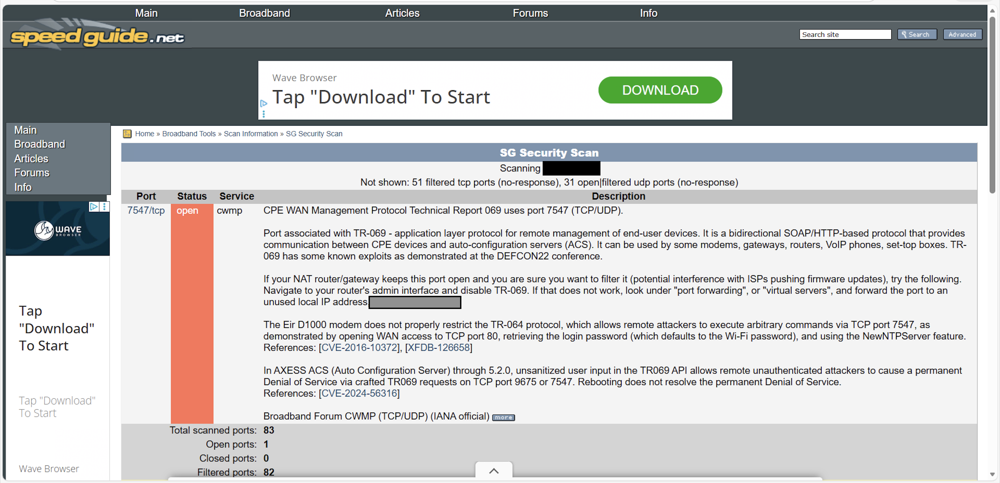

# Internet-Security-Lab
A security analysis of my home network using GRC ShieldsUp and SpeedGuide.

# Lab Report: Internet Security Analysis

## 1. Introduction
In this lab, I tested my computer’s security to see if it is safe from threats on the internet. I used two online tools: **Gibson Research Corporation (GRC)** and **SpeedGuide.net**. 

The purpose of conducting these tests was to scan my network for vulnerabilities. Specifically, I conducted a UPnP Exposure test to see if my router is visible to hackers and a Security Port Scan to check for open doors on my system. The goal was to determine if my firewall is successfully keeping my computer stealth, or if it has any open ports that could be exploited.

## 2. Security Analysis (GRC ShieldsUp!)
* **Test:** GRC ShieldsUp! (UPnP Exposure Test)
* **Result:** **Passed** (Active Rejection)

**Analysis:**
According to the GRC test, my system is **secure**. The test result was "THE EQUIPMENT AT THE TARGET IP ADDRESS ACTIVELY REJECTED OUR UPnP PROBES!" This means my router correctly blocked the unauthorized connection attempt. However, because it sent a reply (Active Rejection) rather than ignoring the request entirely, the system is technically "visible" to hackers, even though they cannot get in.

## 3. Comparison of Results (SpeedGuide.net)
* **Test:** SpeedGuide.net Security Scan
* **Result:** **Mostly Secure** (1 Open Port found)

**Comparison:**
When comparing the two tools, **SpeedGuide.net** provided a more detailed result than **GRC**.
* **GRC** focused only on the UPnP protocol and gave a "Pass."
* **SpeedGuide** scanned 83 common ports. While it found that 82 ports were "Filtered" (Stealth), it successfully detected **1 Open Port: Port 7547**.

**Findings:**
The open port (7547) is identified as the **CWMP (TR-069)** protocol, which is used by my Internet Service Provider to manage the router. This highlights a significant difference: GRC did not flag this because it wasn't looking for it, whereas SpeedGuide correctly identified that my ISP has a management door open on my device.

## 4. Conclusion
This lab confirms that while my personal computer configuration is secure, blocking standard attacks, the router provided by my ISP has a specific management interface, Port 7547, exposed to the internet. This demonstrates why it is important to use multiple scanning tools, as one might catch a vulnerability that the other misses. Overall, my computer system is secure. The firewall is successfully hiding my personal activity like web browsing and files from the internet. The only open door, Port 7547, is a maintenance tool used by my Internet Service Provider, not a security failure on my part.
